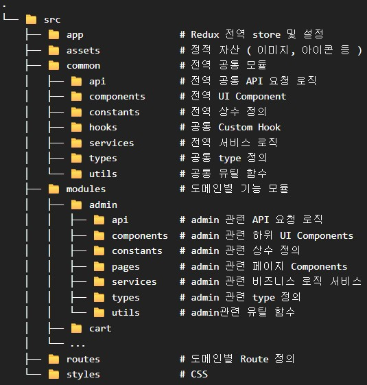
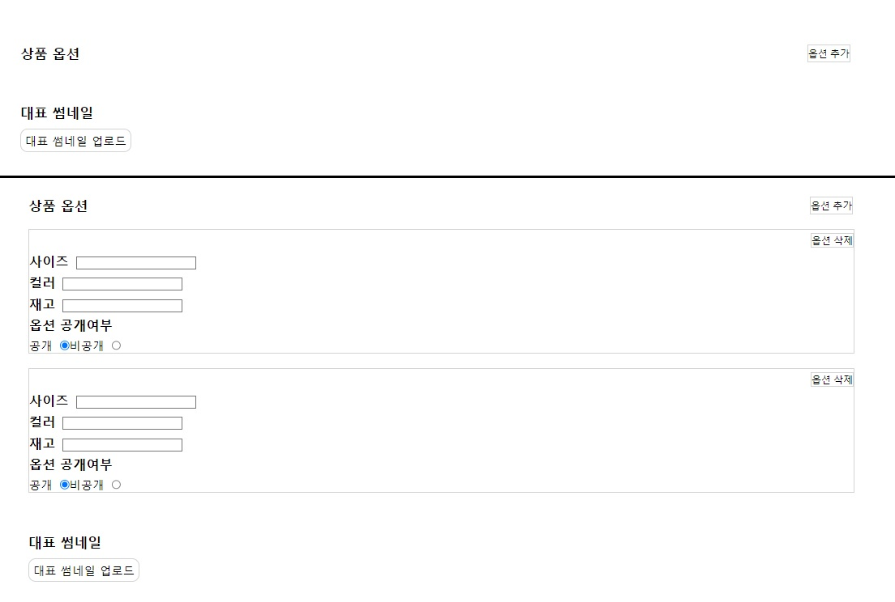

# Man's Shop Frontend

# 프로젝트 요약
> Man's Shop의 Frontend 환경입니다.   
> 이전 버전에서 Frontend, Backend의 통합 빌드 구조였지만, 멀티 모듈에서 분리하도록 설계하면서   
> 단순 분리만 하는 것이 아닌 TypeScript 기반으로 재구현했습니다.

### 단일 모듈(통합 빌드) 버전 Github
* https://github.com/Youndae/mansShop
### 멀티 모듈 버전 Github
* https://github.com/Youndae/mansShop_multi

<br/>

# 목차
<strong>1. [프로젝트 구조](#프로젝트-구조)</strong>   
<strong>2. [개발 환경](#개발-환경)</strong>   
<strong>3. [페이지별 기능 상세](#페이지별-기능-상세)</strong>   
<strong>4. [개선 내역](#개선-내역)</strong>

# 프로젝트 구조



* src 하위에 크게 modules와 common으로 분리.
* common은 2개 이상의 도메인에서 재사용되는 공통 로직 및 Component
	* 단 한번이라도 다른 도메인에서 사용된다면 common으로 분리하도록 규칙을 설계
* modules는 각 도메인별 로직 및 Component
* API 요청은 Axios로 처리
	* 각 컴포넌트에서 직접 호출하는 것이 아닌 각 도메인 또는 common의 Service를 통해 api.js 파일로 접근해 호출하는 구조.
	* 별다른 비즈니스 로직이 존재하지 않더라도 Service를 거치는 구조로 설계
	* utils의 경우 간결한 로직 및 api.js를 호출하지 않는 구조로 설계
* 컴포넌트와 로직 모두 중복을 최소화 할 수 있도록 설계
* type은 props의 type과 같이 특정 Component에 완전 종속되는 type은 Component에서 작성하고 그 외의 경우는 모두 types/ 하위로 분리

<br/>

# 개발 환경

- reduxjs/toolkit 2.8.2
- stomp/stompjs 7.1.1
- sockjs-client 1.6.1
- axios 1.11.0
- dayjs 1.11.11
- react 19.1.1
- react-cookie 7.1.4
- react-dom 19.1.1
- react-redux 9.2.0
- redux-persist 6.0.0
- react-router-dom 7.8.0
- react-toastify 11.0.5
- styled-components 6.1.19
- react-daum-postcode 3.1.3
- dev
	- eslint/js 9.33.0
	- @types/node 24.2.1
	- vite 7.1.2
	- typescript 5.8.3
	- typescript-eslint 8.39.1

# 페이지별 기능 상세

<details>
  <summary><strong>공통</strong></summary>

* 실시간 알림
	* 관리자의 주문 확인
	* 상품 문의 답변
	* 회원 문의 답변
	* 리뷰 답변
</details>

<br/>

<details>
  <summary><strong>메인 화면</strong></summary>

* BEST, NEW, 상품 분류별 목록 출력
* 상품 리스트 페이징
* 상품명 검색
* 장바구니
	* 장바구니 상품 수량 증감
	* 장바구니 상품 선택 또는 전체 삭제
	* 장바구니 상품 선택 또는 전체 구매
* 주문 조회(비 로그인시에만 출력. 로그인 시 마이페이지에서 조회 가능)
* 로그인
	* 회원가입
	* 로컬 로그인 및 OAuth2 로그인 ( Google, Kakao, Naver )
	* 아이디 및 비밀번호 찾기 ( 비밀번호 찾기 기능은 Mail로 인증번호 전송을 통한 인증 이후 처리 )
	* 로그아웃
* 비회원
	* 장바구니( Cookie 기반 )
	* 주문 및 결제
	* 주문 내역 조회 ( 받는사람, 연락처 기반 )
</details>

<br/>

<details>
  <summary><strong>상품 상세</strong></summary>

* 상품 정보 출력
* 상품 옵션 선택
* 장바구니 담기
* 관심상품 등록
* 선택 상품 수량 증감
* 선택 상품 결제
* 상품 리뷰 리스트
* 상품 문의 목록 출력 및 작성
</details>

<br/>

<details>
  <summary><strong>마이페이지</strong></summary>

* 주문 목록
	* 배송완료 상품 리뷰 작성
* 관심 상품 목록
* 문의 내역
	* 상품 문의 내역
		* 문의 상세 정보
		* 문의 삭제
	* 회원 문의 내역
		* 문의 작성
		* 문의 상세 정보
			* 답변 작성
			* 문의 삭제
* 작성한 리뷰 목록
	* 작성한 리뷰 상세 및 삭제
	* 리뷰 수정
* 알림 목록
* 정보 수정
</details>

<br/>

<details>
  <summary><strong>관리자 페이지</strong></summary>

* 상품 관리
	* 상품 목록
	* 상품 검색
	* 상품 추가 및 수정
	* 상품 상세 정보
	* 재고 관리
	* 할인 설정
* 주문 관리
	* 미처리 주문 목록
		* 주문 정보
		* 주문 확인 처리
		* 미처리 주문 검색 ( 받는사람 or 사용자 아이디 )
	* 전체 주문 목록
		* 주문 정보
		* 전체 주문 검색 ( 받는사람 or 사용자 아이디 )
* 문의 관리
	* 상품 문의 관리
		* 미답변 상품 문의 목록
		* 전체 상품 문의 목록
		* 상품 문의 상세 정보
		* 상품 문의 답변 작성
		* 상품 문의 완료 처리
		* 상품 문의 검색 ( 닉네임 and 아이디 )
	* 회원 문의 관리
		* 미답변 회원 문의 목록
		* 전체 회원 문의 목록
		* 회원 문의 상세 정보
		* 회원 문의 답변 작성
		* 회원 문의 완료 처리
		* 회원 문의 검색 ( 닉네임 and 아이디 )
	* 회원 문의 카테고리 설정
		* 카테고리 추가, 삭제
* 회원 관리
	* 회원 목록
	* 회원 상세 정보
		* 회원 주문 목록 조회
		* 회원 상품 문의 내역 조회
		* 회원 문의 내역 조회
* 매출 관리
	* 기간별 매출
		* 선택 연도 월별 매출 목록 및 연매출, 판매량, 주문량
		* 월 매출 상세 정보
			* 베스트 5 상품, 분류별 매출, 일별 매출
			* 분류별 상세 매출
			* 선택 날짜의 전체 주문 내역 조회
	* 상품별 매출
		* 상품별 매출 목록
		* 검색 ( 상품명 )
		* 상품별 매출 상세 정보
			* 옵션별 매출 내역
* 데이터 관리 ( RabbitMQ DLQ 관리 )
	* 실패 메시지 관리
	* 실패 주문 관리
</details>

<br/>

# 기능 및 개선 내역

### 목차
1. [Redux를 통한 로그인 상태 관리](#Redux를-통한-로그인-상태-관리)
2. [Axios Interceptor](#Axios-Interceptor)
3. [상품 옵션 입력 폼 동적 생성 및 삭제](#상품-옵션-입력-폼-동적-생성-및-삭제)
4. [도메인별 Route 분리](#도메인별-Route-분리)

<br />

### Redux를 통한 로그인 상태 관리

<br/>

Frontend에서 로그인 상태 관리나느 reduxjs/toolkit을 통해 처리했습니다.

```typescript
// rootReducer.ts
import { combineReducers } from "@reduxjs/toolkit";
import memberReducer from "@/modules/member/memberSlice"

const rootReducer = combineReducers({
	member: memberReducer,
});

export default rootReducer;
```
```typescript
// store.ts
import { configureStore } from "@reduxjs/toolkit";
import { persistStore, persistReducer } from "redux-persist";
import { FLUSH, REHYDRATE, PAUSE, PERSIST, PURGE, REGISTER } from "redux-persist";
import storage from "redux-persist/lib/storage";
import rootReducer from "@/app/rootReducer";

const persistConfig = {
	key: 'root',
	storage,
	blacklist: ['member'],
};

const persistedReducer = persistReducer(persistConfig, rootReducer);

export const store = configureStore({
	reducer: persistedReducer,
	devTools: import.meta.env.DEV,
	middleware: (getDefaultMiddleware) =>
			getDefaultMiddleware({
				serializableCheck: {
					ignoredActions: [FLUSH, REHYDRATE, PAUSE, PERSIST, PURGE, REGISTER],
				},
			}),
});

export const persistor = persistStore(store);

export type AppDispatch = typeof store.dispatch;
```
```typescript
//memberSlice.ts
import { createSlice, type PayloadAction } from "@reduxjs/toolkit";

import type { MemberState } from "@/common/types/userDataType";

type LoginPayload = {
	userId: string;
	role: string;
};

const initialState: MemberState = {
	loginStatus: false,
	id: null,
	role: null,
};


const memberSlice = createSlice({
	name: 'member',
	initialState,
	reducers: {
		login(state, action: PayloadAction<LoginPayload>) {
			const { userId, role } = action.payload;
			state.loginStatus = true;
			state.id = userId;
			state.role = role;
		},
		logout(state) {
			state.loginStatus = false;
			state.id = null;
			state.role = null;
		},
	},
});

export const { login, logout } = memberSlice.actions;
export default memberSlice.reducer;
```
```typescript
//App.tsx
function App() {
    const dispatch = useDispatch<AppDispatch>();

    useEffect(() => {
        const accessToken = getToken();

        if (!accessToken) {
            dispatch(logout());
            return;
        }

        getMemberStatus()
            .then(({userId, role}) => {
                dispatch(login({userId, role}));
            })
            .catch((err) => {
                console.error('회원 상태 확인 실패: ', err);

                if (err.response?.status === 403) {
                    removeToken();
                }

                dispatch(logout());
            })
    }, [dispatch]);
    
    return (
			<BrowserRouter>
					{/* ... */}
			</BrowserRouter>
	)
}
```

Redux Toolkit과 Redux-persist를 사용해 로그인 상태를 전역적으로 관리하고, 새로고침시에도 상태를 유지할 수 있도록 구성했습니다.   
memberSlice.js를 통해 상태를 관리하며, store.js에서 persist를 통해 localStorage에 자동 저장됩니다.   
App.js의 useEffect를 통해 새로고침 또는 페이지 진입 시 로그인 여부를 서버에 검증하고 Redux 상태에 반영함으로써 UX를 확보할 수 있도록 했습니다.

<br/>

### Axios Interceptor

<br/>

JWT 요청과 오류 응답에 대한 처리를 수월하게 관리할 수 있도록 interceptor를 사용했습니다.   
axios 관련 파일은 모두 common/utils/axios 하위에 위치해있습니다.   
AccessToken을 LocalStorage에 저장하고 관리하기 떄문에 tokenUtils.js에서 토큰 저장 및 조회, 삭제를 처리합니다.   
axios 설정은 Simple과 Enhanced로 나눠지는데 Simple은 401에 대한 응답만 처리하는 interceptor를 갖고 있고,   
Enhanced는 401, 403, 800에 대한 응답을 처리하는 interceptor를 갖습니다.   
두 Axios에서 401 응답은 동일한 처리를 하기 때문에 Enhanced의 Interceptor는 해당하는 응답값이 없는 경우 Simple의 Interceptor로 보내 401을 체크합니다.

로그인 기능의 경우 오류가 발생했을 때 단순히 오류로 처리하고 에러 페이지로 이동하는 것이 아니라 별도의 문구를 보여주는 등의 개별 처리가 필요합니다.   
이런 기능들에 대해 다르게 핸들링을 하기 위해 Axios 설정을 분리했습니다.

```typescript
// tokenUtils.ts
import type { AxiosResponse } from 'axios';

const AUTH_KEY = 'Authorization';

export const getToken = (): string | null => localStorage.getItem(AUTH_KEY);

export const setToken = (token: string | null | undefined): void => {
	if(typeof token === 'string' && token.length > 0)
		localStorage.setItem(AUTH_KEY, token);
};

export const setTokenFromAxios = (res: AxiosResponse): void => {
	const token = res.headers?.['authorization'];
	setToken(token);
};

export const removeToken = (): void => localStorage.removeItem(AUTH_KEY);
```
```typescript
//axiosInterceptors.ts
import { getToken, setTokenFromAxios, removeToken } from '@/common/utils/axios/tokenUtils';
import { getReIssueToken } from "@/common/services/authService";
import { axiosEnhanced } from '@/common/utils/axios/axiosEnhanced';

import type { AxiosRequestConfig, AxiosResponse, AxiosError, InternalAxiosRequestConfig } from 'axios';

import { RESPONSE_MESSAGE } from '@/common/constants/responseMessageType';

type RetryableAxiosConfig = AxiosRequestConfig & { _retry?: boolean };

//공통 Request Interceptor
export const requestInterceptor = (config: InternalAxiosRequestConfig): InternalAxiosRequestConfig => {
	const token: string | null = getToken();
	if(token){
		config.headers['Authorization'] = token;
	}

	return config;
}

// 401에 대한 처리만 하는 Interceptor
export const simpleResponseInterceptor = async (error: AxiosError): Promise<never> => {
	if(error.response?.status === 401) {
		const cfg = error.config as RetryableAxiosConfig;
		cfg._retry = true;

		try {
			const res: AxiosResponse = await getReIssueToken();

			if(res.data?.message === RESPONSE_MESSAGE.OK) {
				setTokenFromAxios(res);
				if(cfg.headers)
					cfg.headers['Authorization'] = getToken() ?? '';
				return axiosEnhanced(cfg);
			}
		}catch(err: unknown) {
			console.error('Token Reissue failed : ', err);
		}
	}

	return Promise.reject(error);
};

// 401, 403, 800에 대한 처리만 하는 Interceptor
export const enhancedResponseInterceptor = async (error: AxiosError): Promise<AxiosError> => {
	const status: number = error.response?.status ?? 0;
	const message: string = (error.response?.data as { errorMessage?: string } | undefined)?.errorMessage ?? '';

	if(status === 800) {
		removeToken();
		alert('로그인 정보에 문제가 발생해 로그아웃됩니다.\n문제가 계속된다면 관리자에게 문제해주세요.');
		window.location.href = '/';
	}else if(status === 403 || message === 'AccessDeniedException') {
		window.location.href ='/error';
	}else {
		return simpleResponseInterceptor(error);
	}

	return Promise.reject(error);
}
```

```typescript
//axiosSimple.ts
import axios from 'axios';
import { requestInterceptor, simpleResponseInterceptor } from '@/common/utils/axios/axiosInterceptors';
import type { AxiosResponse, AxiosError, InternalAxiosRequestConfig } from 'axios';

// AccessDenied, TokenStealing(800)이 절대 발생할 수 없다는 보장이 있으면서,
// 403에 대한 처리를 직접 작성하는 경우 사용되는 axios
// ex) login에서 403(BadCredentials) 발생 시 오류로 분류할게 아니라 잘못 입력되었다고 overlap 출력을 해야 하는 경우
export const axiosSimple = axios.create({
	baseURL: '/api',
	withCredentials: true,
});

axiosSimple.interceptors.request.use(requestInterceptor as (config: InternalAxiosRequestConfig) => InternalAxiosRequestConfig);
axiosSimple.interceptors.response.use(
		(res: AxiosResponse) => res,
		(err: AxiosError) => simpleResponseInterceptor(err)
)
```

```typescript
//axiosEnhanced.ts
import axios from 'axios';
import type { AxiosResponse, InternalAxiosRequestConfig } from 'axios';
import { requestInterceptor, enhancedResponseInterceptor } from '@/common/utils/axios/axiosInterceptors';

//대부분의 요청에 사용되는 axios
export const axiosEnhanced = axios.create({
	baseURL: '/api',
	withCredentials: true,
});

axiosEnhanced.interceptors.request.use(requestInterceptor as (config: InternalAxiosRequestConfig) => InternalAxiosRequestConfig);
axiosEnhanced.interceptors.response.use(
		(res: AxiosResponse) => res, enhancedResponseInterceptor
);
```

Request Interceptor에서는 AccessToken 조회 후 존재한다면 Authorization 헤더에 담는 처리만 합니다.
401 응답이 발생하는 경우 토큰 만료라는 의미이기 때문에 getReIssueToken() 함수 내부에서 재발급 요청 이후 토큰 저장까지 처리합니다.
이후 저장된 토큰을 통해 사용자 요청을 재전달 할 수 있도록 처리했습니다.
800 응답의 경우 토큰이 탈취되었다는 응답이기 때문에 사용자에게 안내 문구를 출력 후 모든 토큰이 제거됩니다.

<br/>

### 상품 옵션 입력 폼 동적 생성 및 삭제

<br/>

상품 추가 폼은 추가, 수정에서 모두 사용되기 대문에 AddProductForm으로 하위 컴포넌트를 생성해 처리했습니다.   
여기서 옵션 추가에 대해서는 버튼 클릭 시 옵션 설정 폼이 추가되도록 처리했습니다.



옵션 추가 버튼 이벤트가 발생하면 optionList라는 useState 배열에 객체를 추가하는 형태로 처리했습니다.   
AddProductForm에서는 이 optionList의 사이즈만큼 폼을 출력하고 데이터를 출력하도록 처리했습니다.

```typescript
//AdminAddProduct.tsx
//...
function AdminAddProduct() {
    //...
	const [optionList, setOptionList] = useState<AdminAddProductOptionType[]>([]);
    //...

	// 상품 옵션 추가 버튼 이벤트
	const handleAddOption = (): void => {
		const optionArr: AdminAddProductOptionType[] = [...optionList];

		optionArr.push({
			optionId: 0,
			size: '',
			color: '',
			optionStock: 0,
			optionIsOpen: true
		});

		setOptionList(optionArr);
	}

	//상품 옵션 input 입력 이벤트
	const handleOptionOnChange = (e: React.ChangeEvent<HTMLInputElement>): void => {
		const name = e.target.name;
		let value: string | number = e.target.value;
		const idx = Number(e.target.parentElement?.parentElement?.getAttribute('data-index'));

		if(name === 'optionStock') {
			value = Number(value);
		}

		optionList[idx] = {
			...optionList[idx],
			[name]: value,
		};

		setOptionList([...optionList]);
	};
    
    //...
}
```

```typescript
// AdminAddProductForm.tsx
//...
function AdminAddProductForm() {
    //...
	return (
		{/* ... */}
			{optionList.map((data, index) => {
				let sizeText = '';
				let colorText = '';
				if(data.size !== null)
					sizeText = data.size;
				if(data.color !== null)
					colorText = data.color;
				return (
						<div key={index} data-index={index} className="option-detail">
				<div className="option-detail-header">
				<DefaultButton
						btnText={'옵션 삭제'}
				onClick={handleRemoveOption}
				name={String(data.optionId)}
				value={index}
				/>
				</div>
				<div className="option-size">
				<label className="product-label">사이즈</label>
						<input className="product-input" type={'text'} name={'size'} onChange={handleOptionOnChange} value={sizeText}/>
				</div>
				<div className="option-color">
				<label className="product-label">컬러</label>
						<input className="product-input" type={'text'} name={'color'} onChange={handleOptionOnChange} value={colorText}/>
				</div>
				<div className="option-stock">
				<label className="product-label">재고</label>
						<input className="product-input" type={'number'} name={'optionStock'} onChange={handleOptionOnChange} value={data.optionStock}/>
				</div>
				<div className="option-isOpen">
				<label className="product-label">옵션 공개여부</label>
				<div className="product-isOpen-radio isOpen-radio">
				<label className="radio-label-label">공개</label>
						<input className="radio-input" type={'radio'} name={`optionIsOpen/${index}`} onChange={handleOptionRadioOnChange} checked={data.optionIsOpen}/>
				<label className="radio-label">비공개</label>
						<input className="radio-input" type={'radio'} name={`optionIsOpen/${index}`} onChange={handleOptionRadioOnChange} checked={!data.optionIsOpen}/>
				</div>
				</div>
				</div>
			)
			})}
		{/* ... */}
	)
}
```

이렇게 처리하고 입력되는 데이터 onChange 핸들링에 대해서는 상위 div의 data-index에 index를 갖도록 처리하게 되면서 해당 index의 데이터 값에 대한 핸들링을 처리할 수 있도록 구현했습니다.

### 도메인별 Route 분리

<br/>

기존 jsx 기반에서는 App.js에서 각 페이지 Component들을 모두 import하고 Route 해주는 방법으로 구현했으나, 이번에는 분리하는 방법을 택해 개선했습니다.   
어떻게 분리할지 설계하던 중 규칙이 필요할 것 같아서 규칙을 먼저 설계했습니다.

1. 메인페이지 같이 공통 prefix가 없는 경우에는 App.tsx에 페이지 Component를 직접 import하는 방법으로 처리한다.
2. 주문 페이지, 장바구니 페이지와 같이 하나의 페이지 Component만 존재하고 추후 추가될 가능성이 적은 경우에는 App.tsx에서 직접 import 한다.
3. 현재는 하나의 페이지 Component만 존재하지만 추후 추가될 가능성이 존재하는 경우 분리한다.
4. Route의 분리는 도메인별로 분리한다.

이런 규칙을 통해 메인, 로그인 관련, 주문, 상품 상세, 장바구니 페이지는 분리하지 않았고, 마이페이지, 관리자페이지, 에러 페이지만 분리했습니다.   
분리되는 Route.tsx는 src/routes 하위에 위치하도록 했습니다.

```typescript
//App.tsx
//...
import Navbar from '@/common/components/Navbar';
import MyPageRoutes from '@/routes/MyPageRoutes';
import AdminRoutes from '@/routes/AdminRoutes';
import ErrorRoutes from '@/routes/ErrorRoutes';

import Best from '@/modules/main/pages/Best';
import New from '@/modules/main/pages/New';
import MainClassification from '@/modules/main/pages/MainClassification';
//...

function App() {
    //...
	
	return (
			<BrowserRouter>
					<div className='container'>
					<Navbar />
					<Routes>
						{/* 로그인 등 회원 관련, 메인, 주문 페이지 라우팅. 공통 prefix 경로가 없기 때문에 직접 라우팅 */}

						{/* 메인 페이지 라우팅 */}
						<Route index element={<Best />} />
						<Route path='/new' element={<New />} />
						<Route path='/category/:classification' element={<MainClassification />} />
						<Route path="/search" element={<SearchProduct />} />
					
						<Route path='/order/info' element={<AnonymousOrderInfo />}/>
						<Route path='/order/detail' element={<AnonymousOrderList />}/>
					
						{/* 로그인 관련 회원 페이지 라우팅 */}
						<Route path='/login' element={<Login />} />
						<Route path='/register' element={<Register />} />
						<Route path='/oAuth' element={<OAuth />} />
						<Route path='/search-id' element={<SearchId />}/>
						<Route path='/search-pw' element={<SearchPw />}/>
						<Route path='/reset-pw' element={<ResetPassword />} />
					
						{/* 주문 페이지 라우팅 */}
						<Route path='/payment' element={<Order />} />
					
						{/* 상품 페이지 라우팅 */}
						<Route path='/product/:productId' element={<ProductDetail />} />
					
						{/* 장바구니 페이지 라우팅 */}
						<Route path='/cart' element={<Cart />} />
					
						{/* 마이페이지 라우팅 */}
						<Route path='/my-page/*' element={<MyPageRoutes />} />
					
						{/* 관리자 페이지 라우팅 */}
						<Route path='/admin/*' element={<AdminRoutes />} />
					
						{/* 에러 페이지 라우팅 */}
						<Route path='/*' element={<ErrorRoutes />} />
					</Routes>
					<ToastContainer
						position="top-right"
						autoClose={5000}
						hideProgressBar={false}
						newestOnTop={false}
						closeOnClick
						rtl={false}
						pauseOnFocusLoss
						draggable
						pauseOnHover
						theme="light"
					/>
			</div>
			</BrowserRouter>
	)
}
```

```typescript
//AdminRoutes.tsx
import { Routes, Route } from 'react-router-dom';

import AdminProductList from '@/modules/admin/pages/product/AdminProductList';
import AdminProductDetail from '@/modules/admin/pages/product/AdminProductDetail';
//...

function AdminRoutes() {
    return (
        <Routes>
				<Route path='product' element={<AdminProductList />} />
				<Route path='product/:productId' element={<AdminProductDetail />}/>
				{/* ... */}
		</Routes>
	)
}
```

이렇게 분리하게 되면서 복잡했던 Route 가독성이 증가했고, 도메인별 분리를 통해 path관리, 페이지 컴포넌트 import 관리가 수월해지는 효과를 볼 수 있었습니다.


---

# History

### 2025/08/19
> 프로젝트 시작
>> 기본 설정 및 구조 처리   
>> common 모듈 전체 작성

<br/>

### 2025/08/20
> main, order 모듈 구현 완료
>> 브라우저 테스트 수행 결과 정상   
>> 페이지 접근 테스트만 했기 때문에 기능 테스트는 완료 이후 테스트 필요   
>> 페이지네이션 처리 테스트까지만 확인

<br/>

### 2025/08/21
> member, product 모듈 구현 완료
>> 테스트는 미수행   
>> 이대로 빠른 구현 목표

<br/>

### 2025/08/22
> cart 모듈 구현 완료

<br/>

### 2025/08/23
> MyPage 모듈 구현 완료   
> Routes 분리

<br/>

### 2025/08/24
> Admin 모듈 구현중

<br/>

### 2025/08/26
> Admin 모듈 구현 완료   
> AdminRoutes 작성, CartRoutes 제거.   
> 브라우저 테스트 시도 중 proxy 문제 발생
>> 3000/api/api/main/  이런 경로로 요청을 보내게 되면서 404가 발생하는 것이 문제.   
>> proxy 설정을 주석처리하고 Axios url을 직접 localhost:8080/api로 설정해보니 웹 소켓 접근 문제라는 것을 확인.   
>> 백엔드의 WebSocketConfig에서 setAllowedOriginPatterns() 설정이 안되어 있었기 때문에 발생한 문제.   
>> 백엔드에서 해당 부분을 추가해주고 proxy 설정 주석을 해제했더니 문제가 해결.   
>> 하지만 3000/api/api/main으로 요청이 발생하는건 동일했고 정상적으로 데이터를 가져오는 것을 확인.   
>> 경로가 이상해서 확인해보니 정상적인 처리는 아니고 마치 되는 것 처럼 보이는 듯한 착각이라고 함.   
>> 해당 문제 해결로 proxy 설정 중 rewrite를 제거, 각 api 파일의 BASE_URL에서 api를 제거하는 방법으로 문제 해결.   
>> 그럼에도 3000/api/main으로 요청이 발생하는데 정상 동작.   
>> 알아보니 CRA에서는 8080으로 출력되지만 Vite 환경에서는 3000 으로 나오게 되고, Vite가 내부적으로 처리한다는 점을 알게 됨.   
>> 이유에 대해서는 CORS 회피, 보안이 목적.   
>> 같은 도메인에서 요청하는 것 처럼 개발자 도구에 보이기 떄문에 백엔드 정보가 노출이 되지 않게 된다.
> 브라우저 테스트 완료

<br/>

### 2025/09/06
> 백엔드 응답 구조 변경으로 인한 수정.   
> RESPONSE_MESSAGE 상수 객체 응답 구조에 맞게 수정.   
> 응답 오류에 대한 statusCode, message를 추출하는 utils 추가.